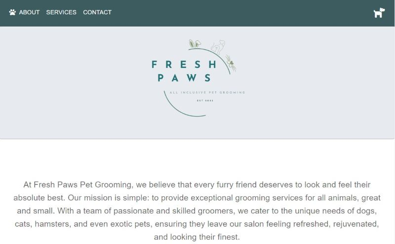
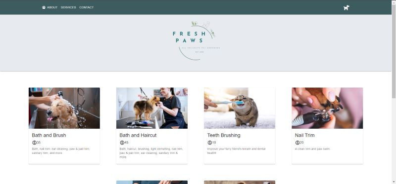

# Fresh-Paws

        

## Table-of-Contents

* [Description](#description)
* [Installation](#install)
* [Usage](#usage)
* [Credits](#credits)
* [License](#license)
* [Links](#links)

## [Description](#table-of-contents)
At Fresh Paws Pet Grooming, we believe that every furry friend deserves to look and feel their absolute best. Our mission is simple: to provide exceptional grooming services for all animals, great and small. With a team of passionate and skilled groomers, we cater to the unique needs of dogs, cats, hamsters, and even exotic pets, ensuring they leave our salon feeling refreshed, rejuvenated, and looking their finest. The application used a number of data persistence techniques that serve as redundancy in case one of the options in not supported by the browser. The app was built with GraphQL, a React front end, MongoDB database, and Node.js/Express.js server, API, queries and mutations to fetch and modify data. Application is deployed to heroku.

## [Installation](#table-of-contents)
No installation needed! Check out the deployed site <a href="https://freshpawsgrooming-9c1c93deb5e9.herokuapp.com/" target="_blank">here</a>!

## [Usage](#table-of-contents)
After viewing our homepage with detailed information about the business,  
  
Create a profile on our profile page,  
  
Then take a look at services we offer and prices,  
  
Create an appointment on our site,  
  
And view all your pets and services on your profile page  
  

## [Credits](#table-of-contents)

- John Alarcon Github: https://github.com/jalarcon95
- Rachel Scime Github: https://github.com/Rscime 
- Amanda Duva Github: https://github.com/amandajduva 
- Derek Marchese Github: https://github.com/dtm589 
- Alexis Vasquez Github: https://github.com/Lexxvasquez 

    
## [License](#table-of-contents)
        
The application is covered under the following license: 
    
[mit](https://choosealicense.com/licenses/mit)

## Links 

[Deployed Site](https://freshpawsgrooming-9c1c93deb5e9.herokuapp.com/)

[Github Repo](https://github.com/jalarcon95/Fresh-Paws)

[Slide-Show Link](https://docs.google.com/presentation/d/1PehS2FEVgBHubWxq43y4Kxd75d-GOpv2f0NbE7NiYgM/edit#slide=id.p)
        
  

